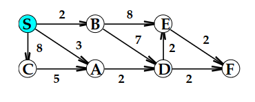
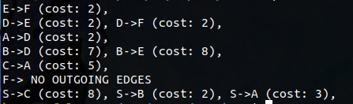

# Graph CPP
An attempt to represent graphs in cpp. Currently the graph is using an adjacency list managed by an unordered map in order to support vertices with char type names.
## Usage
* In main.cpp a sample graph is added and it is printed.
* All forms of the graphs representation is also printed.
* Following printGraph the adjancy list is printed, followed by the integer version of the adjancey list, followed by the adjancey matrix, followed by the weights matrix
* First create your graph
  ```
  Graph g = Graph();
  ```
* Next add verticies to your graph
  ```
  g.addVertex('S');
  g.addVertex('C');
  ```
* Finally add edges to your graph
* If you dont have weights in your graph you may insert the value 1 for each weight
  ```
  g.addEdge('S','C',8);
  g.addEdge('S','C',1); <- weight should be 1 for unweighted graph 
  ```
* If you want a undirected graph, add edges both ways
  ```
  addEdge(src, dest, cost);
  addEdge(dest, src, cost);
  ```
* The graphs data can be extracted in multiple formats
* Getting AdjList 
  ```
  std::vector<std::vector<std::vector<int>>> adj = getAdjInt();
  adj[i][j]    <- jth edge of vertex i
  adj[i][j][0] <- vertex i's jth edge's destination vertex
  adj[i][j][1] <- vertex i's jth edge's cost
  ```
* Getting AdjMatrix
  ```
  std::vector<std::vector<bool>> adjMatrix = getAdjMatrix();
  adjMatrix[i][j] <- true or false value indicating edge from i to j
  ```
* Getting Weights Matrix
  ```
  std::vector<std::vector<int>> W = getWeights();
  W[i][j] <- cost from vertex i to j if it exist, INT_MAX else case
  ```
* You can always convert from integer index to name of vertex and back
  ```
  addVertex('S');
  int vertex_id = charVtoNumV('S');          <- vertex_id is integer id of vertex 'S'
  char vertex_name = numVtoCharV(vertex_id); <- vertex_name = 'S'
  ```
* The goal is to be able to add in your graphs and you can implement your favorite graph algorithms!

## Installation
build using your cpp complier
```sh
$ g++ main.cpp graph.cpp -o output
$ ./output
```
## PREVIEW 
  *  Visual of sample graph.
  *  
  *  Output of printGraph().
  *  


